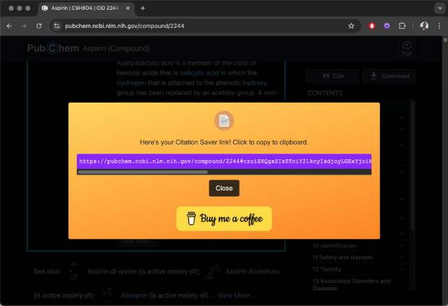

# Citation Saver

## What This Thing Does

Citation Saver allows you to link directly back to content you highlight on a page--that way you can cite text on a page and return to it later.

If you follow a Citation Saver link in another browser (or if you decide to uninstall Citation Saver), your link will still be valid and will take you to the same page; your browser just won't automatically highlight the citation.

This is not a link shortening service. I'm not logging any of your page visits; the experience takes place entirely in your browser.
 
 

## How to Install This Thing

Install it from the [Chrome Web Store](https://chrome.google.com/webstore/detail/citation-saver/kkjfcmbefhilcekbiphpfmkihbligdef).
 
 

## How To Use This Thing

1. Highlight some content on a page.

2. Right-click it.

3. Click "Get citation link."

4. Click the provided Citation Saver link to copy it to your clipboard. Done!
  

 
 

## How To Report Problems With This Thing

Found a bug? Help make Citation Saver better by reporting the issue to citationsaver@gmail.com. Please include the following information:
- A description of the issue
- The URL of the relevant page
- The Citation Saver URL (if applicable)
- The content you're trying to cite
- The version of Chrome you're running
- A screenshot (optional but helpful)

## How to Support This Thing

There's an innocuous ad that appears when you create a Citation Saver link. Click it if you're so inclined!

 
 

Advertisement
<iframe src="https://johnpleung.github.io/citation-saver-ad/" frameborder="0"></iframe>
